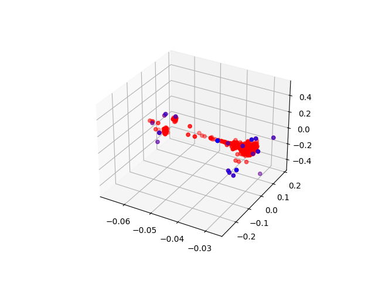

# Academic PDF Automated Reference Tagging System

Automated workflow to generate a tailored set of keywords and index academic articles. Designed to be used in combination with reference editors, and markdown-based personal knowledge management systems like obsidian and notion.


<br>

## Functionality
- Import (scholarly) records using a query representative of the field of research.
- Generate a set of keywords by processing titles and abstracts using 7 NLP algorithms.
- Tag all pdf files within a folder irrespective of folder structure.
- Return the keywords to a .bib file for use in reference managers, and .csv for meta-analysis.
- Generate dynamic .md summaries per author, article and journal for use in markdown knowledge bases.

#### additional functionality
- Pdf to txt conversion.
- Bib to csv conversion.
- Tag articles weighted by section in which each tag is found.
- Download missing pdf files using sci-hub.
- Generate article summaries.
- Integrated node-network visualization.
- Query expansion by (pseudo) relevane.
- Select articles based on tag dissimilarity.

<br>

## Use cases
- Optimizing queries for scientific review.
- Article selection for scientific review.
- Indexing bilbiography.
- Node-network analysis.

<br>

## What to expect
### input
- A query representative of the field of research.
- .bib file containing the references to be indexed
- Folderpath containing article pdf files.


### output
- .bib file containing article metadata supplemented by tags.
- .csv file containing the article metadata supplemented by tags.
- .md files per article, author and journal, giving a dynnamic and interlinked overview of metadata and associated tags and (co-)authors by frequency.

<br>

## Workflow
### Direct dependencies
This package relies on the textrank and topicrank models from https://github.com/boudinfl/pke/tree/master. As pypi does not allow direct dependencies this has to be installed manually:
```{python}
pip install git+https://github.com/boudinfl/pke.git
```

### building a keyword list:
Collect tags by scanning titles and abstracts of about 200 articles.
1. Use a query for the field of interest to download a csv of the first 200-1000 records using web of science, google scholar (scholarly script included) or pubmed (using the 3rd party publish or perish software) to use as input. 
2. Indicate whether i) author given keywords present in the searchrecords csv and ii) existing tags in a .bib file should be included.
3. Collect keywords from the titles and abstracts using 7 common NLP algorithms[^1]: bigram, keybert, RAKE, textrank, topicrank, TF-IDF and YAKE:
[^1]: by default only keywords present in 2-4 of the algorithms their output are to prevent lay terms from being included.
```{python}
generate_keylist(records = "input/records.csv", bibfile = "input/Library.bib")
```

### tag pdf files
Scrape pdf files and tag based on presence in the different article sections.
1. Provide a path to the pdf files that should be tagged (irrespective of subfolder structure) and the original .bib file that should be used for metadata.
2. indicate whether additional keylists should be used[^2], tagging should be weighted by section[^3] and whether markdown summaries should be generated.
[^2]: Options include: 'all', 'statistics', 'countries', 'genomics', 'phylogenies', 'ecology', 'culicid_genera' or any combinations thereof e.g. "statistics and countries".
[^3]: Weighing is determined as follows: Abstract: 4, Discussion: 3, Methods|Results: 2, Introduction:1, References: 0. A custom treshold used for exlcuding tags may be assigned (defaults to '2').
3. Convert all articles to .txt, tag them and export tags to bib/csv/md:
```
 automated_pdf_tagging(source_folder="C:/.../Zotero/storage", bibfile="input/pc_Library_1-5-2023.bib", alternate_lists="all", weighted = True, treshold = 5, summaries = True)
```

### select articles by dissimilarity
Calculate tag-based dissimilarity, amd select the most dissimilar articles. 
1. Provide a path to the CSV file containing the corpus to sample from.
2. Indicate the amount of articles that should be selected.
```
 subsample_from_csv(CSV_path="C:/.../output/csv/total.csv", n=30)
```

<figcaption align = "center"><b>Fig.1</b> Selected articles in blue superimposed over the corpus in red.</figcaption>

#### Markdown summaries
Generate text based summaries using javascript code blocks so that the database stays dynamically updated.

##### Article summary
Summary per article containing citation metadata, abstract and tags.
Interlinked to pdf file, relevant journal and authors.

##### Author summary
Summary per author containing relevant links, co-authors by frequency, tags by frequency and associated papers.
Interlinked to relevant co-authors, papers and journals. The interlinked records are dynamicly updated using javascript queries.

##### Journal summary
Summary per journal containing authors by frequency, tags by frequency and associated papers. Interlinked to relevant papers and authors. The interlinked records are dynamically updated using javascript queries.

<br>

## Documentation
Documentation for the package can be found at the [read the docs page](https://aparts.readthedocs.io/en/latest/).

<br>

## Commonly wondered inqueries
**When I use the tagging functions multiple times, will articles which already have been tagged be skipped?**

- Yes, to improve efficiency keylist_search automatically checks whether a file is present in the output csv file and skippes file shat have been indexed.


**How may I improve results?**

- A manual check to remove artifacts from the generated keywords is advised. Artifacts may be produced in case of typesetting issues (mainly in older pdf files), decoding issues or words containing special characters like chemical compounds.


**I get decoding errors for certain documents during keylist_search().**

- PDF encoding is not standardized and although this package automatically uses common decoding fixes, some articles might still return errors. In this case you may need to manually get rid of unicode characters in the respective txt file with an ascii converter like https://onlineunicodetools.com/convert-unicode-to-ascii.

**I got unknown widths|multiple definitions|Unexpected escaped string errors during pdf2txt conversion. What happened?**
- This happens when the contents of a pdf cannot properly be read. This may be caused by files being corrupt or consisting of scanned pages as may be the case for older pdf files.

**How long will the process take?**

- Several functions may be time consuming. The scholarly lookups for article or author might take several minutes, keyword generation about 10 minutes for 100 records and keylist_search may take about 10 minutes for 500 files. 
